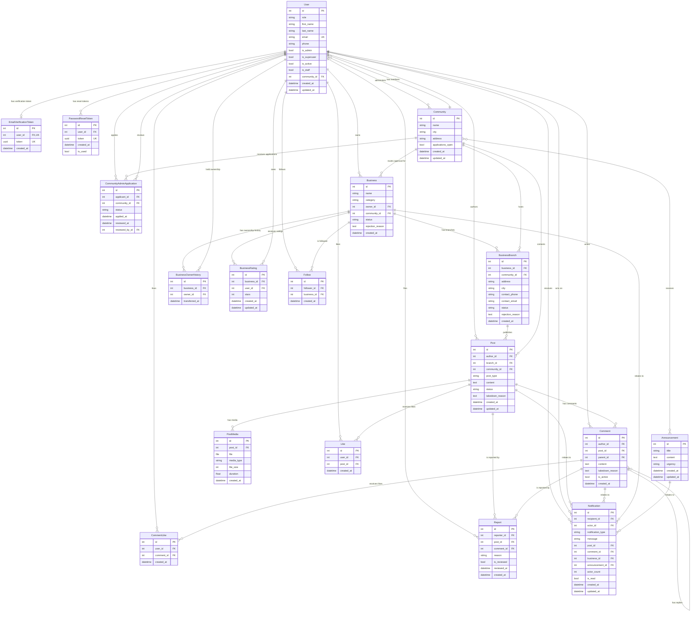

**Database constraints**

- `BusinessRating`: one rating per `(business, user)` pair.
- `Follow`: one follow per `(follower, business)` pair.
- `Like`: one like per `(user, post)` pair.
- `CommentLike`: one like per `(user, comment)` pair.
- `CommunityAdminApplication`: one pending application per `(applicant, community)` pair.
