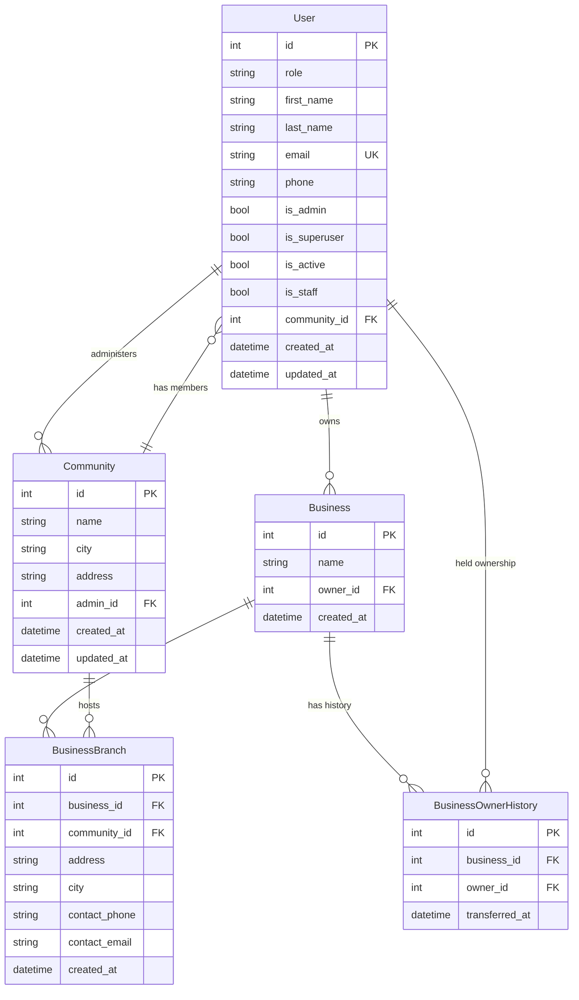

```mermaid
erDiagram
    User {
        int id PK
        string role
        string first_name
        string last_name
        string email UK
        string phone
        bool is_admin
        bool is_superuser
        bool is_active
        bool is_staff
        int community_id FK
        datetime created_at
        datetime updated_at
    }

    Community {
        int id PK
        string name
        string city
        string address
        int admin_id FK
        datetime created_at
        datetime updated_at
    }

    Business {
        int id PK
        string name
        int owner_id FK
        datetime created_at
    }

    BusinessBranch {
        int id PK
        int business_id FK
        int community_id FK
        string address
        string city
        string contact_phone
        string contact_email
        datetime created_at
    }

    BusinessOwnerHistory {
        int id PK
        int business_id FK
        int owner_id FK
        datetime transferred_at
    }

    Community ||--o{ User : "has members"
    User ||--o{ Community : "administers"
    User ||--o{ Business : "owns"
    Business ||--o{ BusinessBranch : "has branches"
    Community ||--o{ BusinessBranch : "hosts"
    Business ||--o{ BusinessOwnerHistory : "has history"
    User ||--o{ BusinessOwnerHistory : "held ownership"
```
