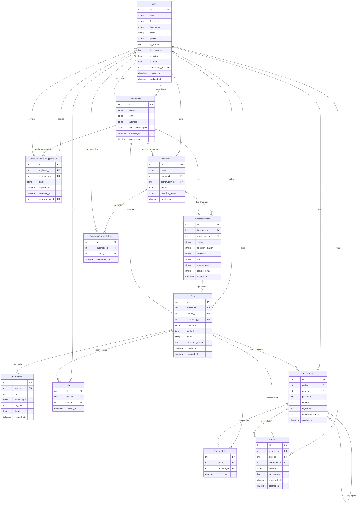

```mermaid
erDiagram
    User {
        int id PK
        string role
        string first_name
        string last_name
        string email UK
        string phone
        bool is_admin
        bool is_superuser
        bool is_active
        bool is_staff
        int community_id FK
        datetime created_at
        datetime updated_at
    }

    Community {
        int id PK
        string name
        string city
        string address
        bool applications_open
        datetime created_at
        datetime updated_at
    }

    CommunityAdminApplication {
        int id PK
        int applicant_id FK
        int community_id FK
        string status
        datetime applied_at
        datetime reviewed_at
        int reviewed_by_id FK
    }

    Business {
        int id PK
        string name
        int owner_id FK
        int community_id FK
        string status
        string rejection_reason
        datetime created_at
    }

    BusinessBranch {
        int id PK
        int business_id FK
        int community_id FK
        string status
        string rejection_reason
        string address
        string city
        string contact_phone
        string contact_email
        datetime created_at
    }

    BusinessOwnerHistory {
        int id PK
        int business_id FK
        int owner_id FK
        datetime transferred_at
    }

    Post {
        int id PK
        int author_id FK
        int branch_id FK
        int community_id FK
        string post_type
        text content
        string status
        text takedown_reason
        datetime created_at
        datetime updated_at
    }

    PostMedia {
        int id PK
        int post_id FK
        file file
        string media_type
        int file_size
        float duration
        datetime created_at
    }

    Like {
        int id PK
        int user_id FK
        int post_id FK
        datetime created_at
    }

    Comment {
        int id PK
        int author_id FK
        int post_id FK
        int parent_id FK
        text content
        bool is_active
        text takedown_reason
        datetime created_at
    }

    CommentLike {
        int id PK
        int user_id FK
        int comment_id FK
        datetime created_at
    }

    Report {
        int id PK
        int reporter_id FK
        int post_id FK
        int comment_id FK
        string reason
        bool is_reviewed
        datetime reviewed_at
        datetime created_at
    }

    Community ||--o{ User : "has members"
    User }o--o{ Community : "administers"
    User ||--o{ CommunityAdminApplication : "applies"
    Community ||--o{ CommunityAdminApplication : "receives applications"
    User ||--o{ CommunityAdminApplication : "reviews"
    User ||--o{ Business : "owns"
    Community ||--o{ Business : "routes approval for"
    Business ||--o{ BusinessBranch : "has branches"
    Community ||--o{ BusinessBranch : "hosts"
    Business ||--o{ BusinessOwnerHistory : "has history"
    User ||--o{ BusinessOwnerHistory : "held ownership"
    User ||--o{ Post : "authors"
    BusinessBranch ||--o{ Post : "publishes"
    Community ||--o{ Post : "contains"
    Post ||--o{ PostMedia : "has media"
    User ||--o{ Like : "likes"
    Post ||--o{ Like : "receives likes"
    User ||--o{ Comment : "writes"
    Post ||--o{ Comment : "has comments"
    Comment ||--o{ Comment : "has replies"
    User ||--o{ CommentLike : "likes"
    Comment ||--o{ CommentLike : "receives likes"
    User ||--o{ Report : "files"
    Post ||--o{ Report : "is reported by"
    Comment ||--o{ Report : "is reported by"
```
